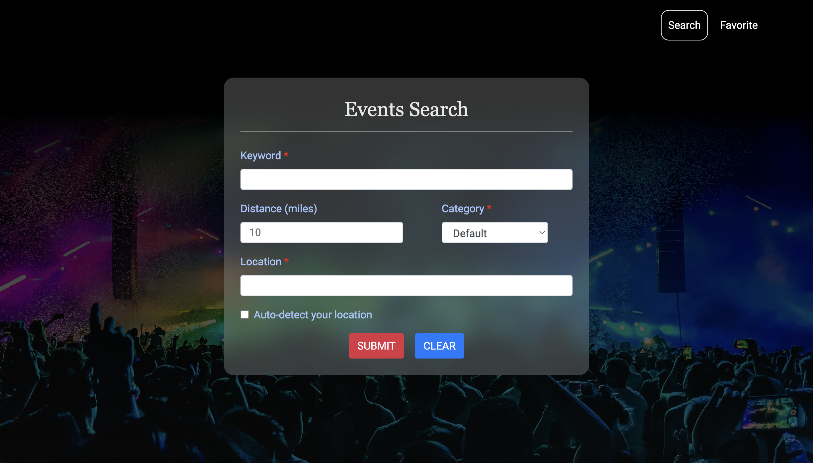
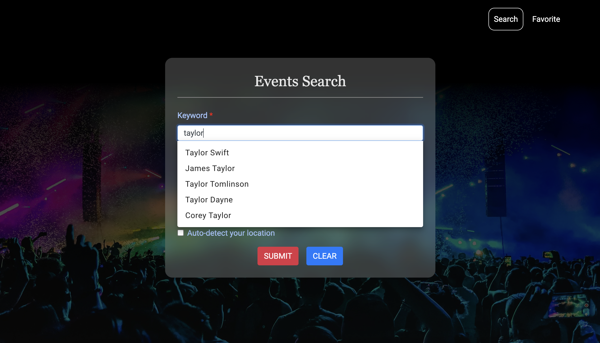
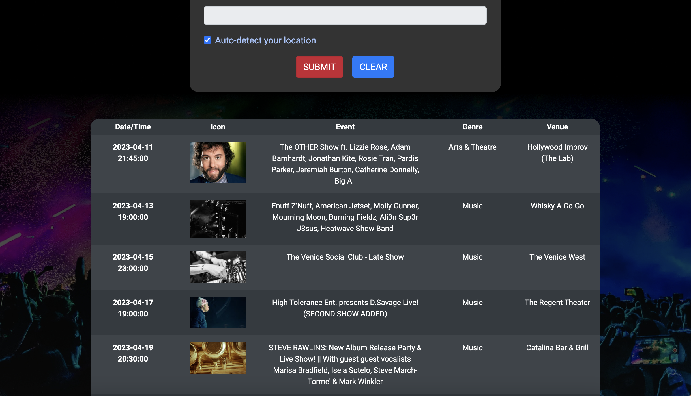
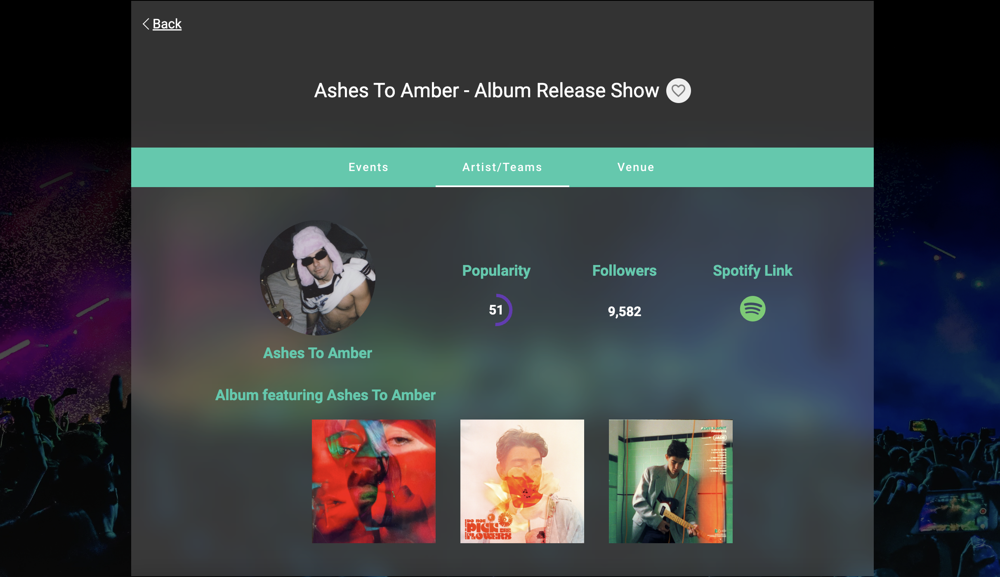
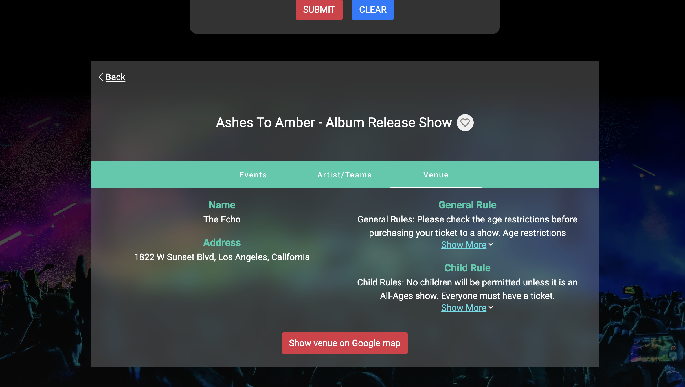
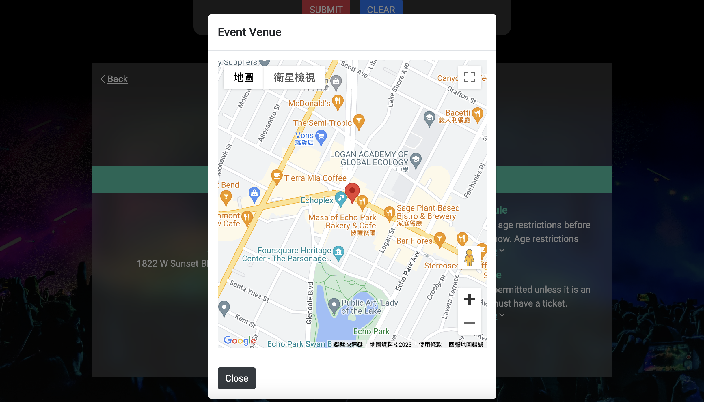
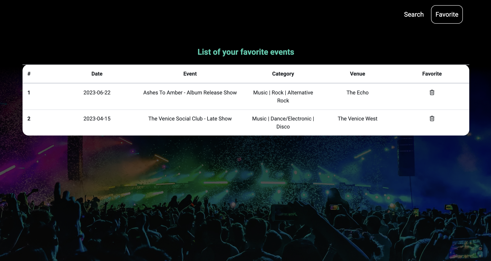

# EventSearcher

Notice: According to the non-descloure aggrement, I can't share the source code publicly. If you want to know more about the details, feel free to contact me.

### Demo Video: https://youtu.be/ZKY0rU5ZILg
### Web Link: https://shorturl.at/ipry5

## Screenshot

### Search Form

- Keyword: keyword for searching. (Auto-suggest five kewords for user) [required]
- Distance: default 10 miles.
- Category: default all.
- Location: searching area. [required]
- Auto-detect Location: toggle it if you want system identify your location automatically.

  
  

### Result Table

Search engine will provide at most 20 results sorted by alphabetical oreder. User can click each row to get detail information for each event.

  

### Event Details

  

### Artists Details

  

### Venue Details

  

### Show Direction on Google Map

  

### Favorite List

  

