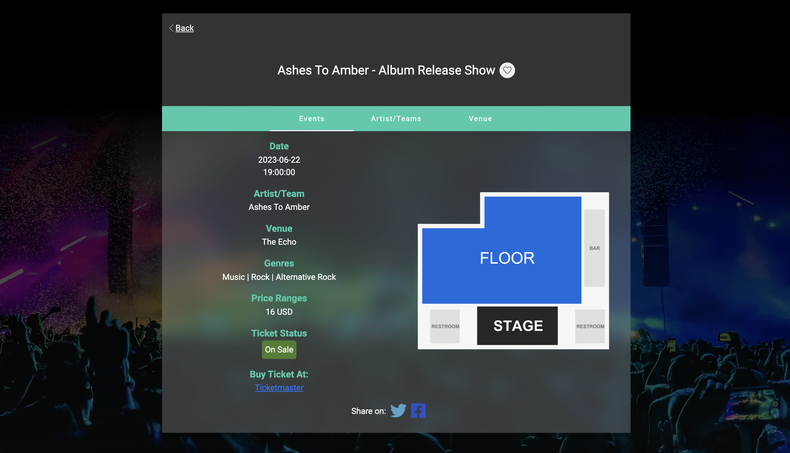

# EventSearcher

Notice: According to the non-descloure aggrement, I can't share the source code publicly. If you want to know more about the details, feel free to contact me.

### Demo Video Web: https://youtu.be/ZKY0rU5ZILg
### Demo Video iOS:https://youtu.be/0uEFgMz_C_s

### Web Link: https://shorturl.at/ipry5

## Screenshot

### Search Form

- Keyword: keyword for searching. (Auto-suggest five kewords for user) [required]
- Distance: default 10 miles.
- Category: default all.
- Location: searching area. [required]
- Auto-detect Location: toggle it if you want system identify your location automatically.

  
  

### Result Table

Search engine will provide at most 20 results sorted by alphabetical oreder. User can click each row to get detail information for each event.

  

### Event Details

This section shows all the information related to the particular event such as date, price, and seatMap. Additionally, user can also get the link for buying the tickect and sharing information on facebook or twitter.

  

### Artists Details

This section shows artist information if that artist is belong to 'Music' category. User can find spotify information about the artist and featured albums.

  

### Venue Details

This section shows venue details and provide the direction information using google map api.

  
  

### Favorite List

User can save their favorite event on watching list by clicking the heart logo next to the event name. Also, user can remove it.

  

